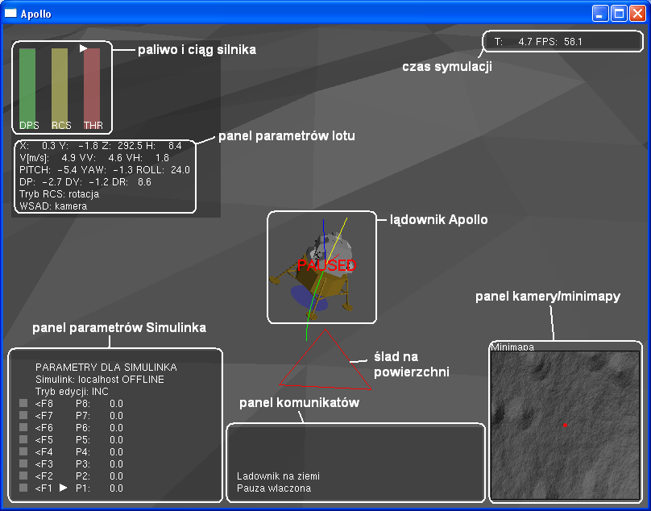

           _/_/_/                      _/   _/
         _/    _/                     _/   _/
        _/    _/   _/_/_/   _/_/_/   _/   _/   _/_/_/
       _/_/_/_/   _/  _/   _/  _/   _/   _/   _/  _/ 
      _/    _/   _/  _/   _/  _/   _/   _/   _/  _/  
     _/    _/   _/_/_/   _/_/_/   _/   _/   _/_/_/   
               _/                                    
              _/                                     
             _/       Adam Wolniakowski 2011     
                                            
    =================================================

1. Introduction
---------------

The package contains an Apollo Lunar Lander Simulator, written in C++. The simulator was written for the master thesis.

Features:
* Apollo landing simulation in 3D
* Full dynamic simulation of the lander
* Simulated rocket engine models
* Author's 3D engine
* Interface for Simulink control
* Several auto-pilots implemented in Simulink
* Stage detachment
* Procedural generation of Moon surface
* and others

2. Linia komend
---------------

	apollo.exe [-h host] [-m mapfile] [-mk 0.0] [-me 0.0] [-g 0.0] [-b 0.0]

	-h host		Adres IP komputera, na którym uruchomiony jest współpracujący model Simulinka.
			Domyślnie localhost.

	-m		Nazwa pliku zawierajacego mape wysokosci powierzchni.

	-mk 		Generator mapy; parametr opisujacy maksymalne poczatkowe zmiany wysokosci.

	-me		Generator mapy; parametr opisujacy redukcje zmian wysokosci w kolejnych krokach.

	-g		Stala grawitacji [m/s^2].

	-b		Opor atmosferyczny [Ns/m].

3. Sterowanie
-------------

 
* Główne

 [esc]		Zakończ program	   
 [p]		Włącz/wyłącz pauzę	   
 [m]		Wygeneruj nową mapę
 [n]		Włącz/wyłącz dżwięk
 [tab]		Sterowanie WSAD: kamera/lądownik	
   

* Kamera

 [w]		Kamera w górę	   
 [s]		Kamera w dół	   
 [a]		Kamera w lewo	   
 [d]		Kamera w prawo	   
 [z]		Przybliż kamerę	   
 [x]		Oddal kamerę	   
 [c]		Ustaw kamerę w położeniu początkowym
 [f]		Włącz tryb pierwszej osoby

* Wyświetlanie	
   
 [v]		Pokaż wektory orientacji, prędkości i przyspieszenia oraz ślad na powierzchni	   
 [b]		Pokaż trajektorię ruchu	   

* Sterowanie lądownikiem	   

 [g]		Umieść lądownik w położeniu początkowym na wysokości 0.0	   
 [o]		Umieść lądownik w położeniu początkowym na wysokości 1000.0
 [j]		Umieść lądownik w położeniu losowym na wysokości 1500.0
[spacja]	Silnik główny: 100% (chwilowo)	   
 [*]		Silnik główny: 100%	   
 [/]		Silnik główny: 0%	   
 [+], [=]		Silnik główny: +5%	   
 [-]		Silnik główny: -5%	   
 [,]		Zmień tryb RCS: rotacja/translacja	   
 [8]/[w]		Pochyl lądownik do przodu	Przesuń lądownik do przodu	   
 [2]/[s]		Pochyl lądownik do tyłu		Przesuń lądownik do tyłu	   
 [4]/[a]		Przechyl lądownik w lewo	Przesuń lądownik w lewo	   
 [6]/[d]		Przechyl lądownik w prawo	Przesuń lądownik w prawo	   
 [1]/[q]		Odchyl lądownik w lewo		Przesuń lądownik do dołu	   
 [3]/[e]		Odchyl lądownik w prawo		Przesuń lądownik do góry	   
 [5]		Włącz/wyłącz killrot	   
 [u]		Włącz/wyłącz zrzut paliwa silnika głównego	 

  
* Współpraca z Simulinkiem
	   
 [r]		Wyślij sygnał 'reset' do Simulinka	   
   
 [F1]		Włącz przełącznik 1. (monostabilny)	   
 [F2]		Włącz przełącznik 2. (monostabilny)	   
 [F3]		Włącz przełącznik 3. (monostabilny)	   
 [F4]		Włącz przełącznik 4. (monostabilny)	   
 [F5]		Włącz/wyłącz przełącznik 5. (bistabilny)	   
 [F6]		Włącz/wyłącz przełącznik 6. (bistabilny)	   
 [F7]		Włącz/wyłącz przełącznik 7. (bistabilny)	   
 [F8]		Włącz/wyłącz przełącznik 8. (bistabilny)	
   
 [góra], [dół]	Wybierz parametr do edycji	   
 [Insert]	Zmień tryb edycji parametrów: inkrementalny/logarytmiczny	   
 [lewo], [prawo] Zmniejsz/zwiększ parametr o 1.0 / razy 1.1	   
 +[CTRL]		Zmniejsz/zwiększ parametr o 0.1	   
 +[SHIFT]		Zmniejsz/zwiększ parametr o 10.0	   
 [Home]		Ustaw parmetr na 0.0	 
